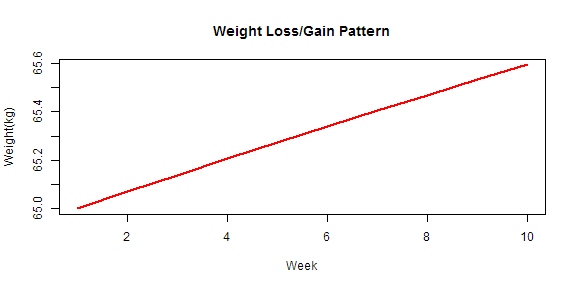

## Body Weight Planner

With the new emphasis on wearable activity monitors and nutritional habits, consumers are now more interested in how their eating habits affect their health.  With this app, we can make it easier to find out.

Specifically we let the user:

1. Calculate their Basic Metabolic Rate
2. Calculate their Total Daily Energy Expenditure
3. View their projected weight loss/gain for a given number of calories consumed.

With this app, users can experiment with the number of calories they consume and see how this will shape their weight loss/gain.

--- .class #id 


## BMR/TDEE Parameters

Basic Metabolic Rate (BMR) is the estimate of the number of calories a person would expend in a day if they were basically stationary.  This number is generally considered the minimum number of calories a person should consume in a day. The BMR calculation is: 


```r
bmr <- 655 + (9.6 * weight) + (1.8 * height) - (4.7 * age) #Female
bmr <- 66 + (13.7 * weight) + (5 * height) - (6.8 * age) #Male
```

We also convert the numbers entered by the user from kilograms to pounds for the user.

Total Daily Energy Expenditure (TDEE) takes the given BMR number and an activity level to determine the number of calories a person expends daily.  A person's TDEE is the number of calories a person should consume to maintain their weight. The TDEE Calculation is:


```r
tdee <- bmr * 1.2
```

where the activity level effect ranges from 1.2 to 1.9

--- .class #id 

## Weekly Progression

With the BMR and TDEE calculations made, our users can now quickly view their estimated weight loss/gains for their desired calorie consumption.  The table below is a sample of results.  Again, the user can change their calorie consumption and view the changes immediately.


| Week|    kg|   lbs|  BMR| TDEE|
|----:|-----:|-----:|----:|----:|
|    1| 65.00| 143.0| 1602| 1923|
|    2| 65.07| 143.2| 1603| 1924|
|    3| 65.14| 143.3| 1604| 1925|
|    4| 65.21| 143.5| 1605| 1926|
|    5| 65.27| 143.6| 1606| 1928|
|    6| 65.34| 143.7| 1607| 1929|
|    7| 65.40| 143.9| 1608| 1930|
|    8| 65.47| 144.0| 1609| 1931|
|    9| 65.53| 144.2| 1610| 1932|
|   10| 65.59| 144.3| 1611| 1933|

Note that we show weight in both in kilograms and pounds to make it easier for the user.

--- .class #id 

## Summary

* This app gives users easy and quick ways to figure out important nutritional calculations
* Immediate results are given to the users in a clear, easy to understand manner
* Users can change numbers and get immediate feedback
* We even give users a graph, just because everyone likes graphs.

 
